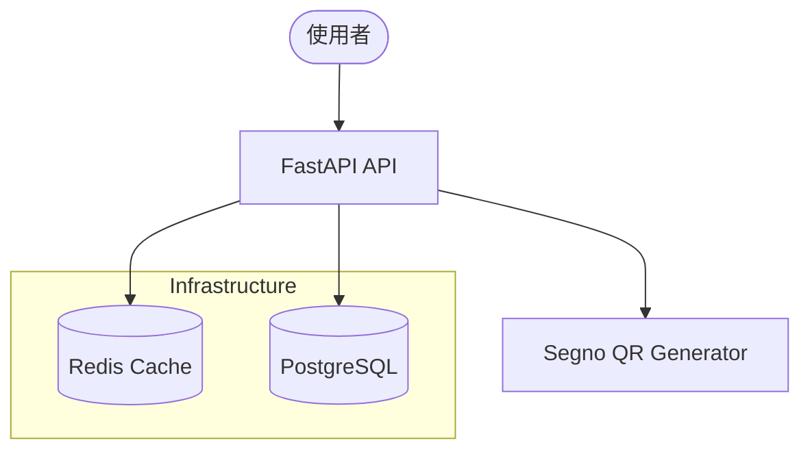

# 系統架構說明

本專案採用非同步 FastAPI 架構，並結合了快取與資料庫持久化技術。

## 整體架構圖

## 1. 資料模型 (Database Schema)

系統主要使用 `urls` 資料表存取記錄：

- `id`: 主鍵
- `original_url`: 原始長網址
- `short_code`: 唯一的 6 位元短代碼
- `url_count`: 累計點擊次數

## 2. 快取策略 (Caching)

為了提高存取效能，系統使用 Redis 進行以下優化：
- **短網址對應記錄**: 當短網址被存取時，會先查詢 Redis。若不存在才查詢資料庫，並將結果存入 Redis（過期時間 24 小時）。
- **點擊計數**: 每次跳轉都會在 Redis 中即時增加 `clicks:{short_code}` 的計數。

## 3. 自動偵測 Ngrok (Smart Base URL)

在 `config.py` 中實現了智慧型網址偵測：
- 系統會嘗試連線到本地的 Ngrok API (`http://ngrok:4040`)。
- 若偵測到作用中的隧道，會自動擷取 `public_url` 作為短網址的基準路徑。
- 這使得在本地開發時，生成的 QR Code 能夠直接被外部設備（如手機）掃描並存取。

## 4. 跳轉邏輯

系統不使用 301/302 HTTP 跳轉，而是返回一個包含 JavaScript 的 HTML 頁面。
原因：
- 確保瀏覽器能正確執行跳轉，同時在背景更新點擊數據。
- 支援一些對 HTTP 跳轉限制較嚴格的掃碼環境。
